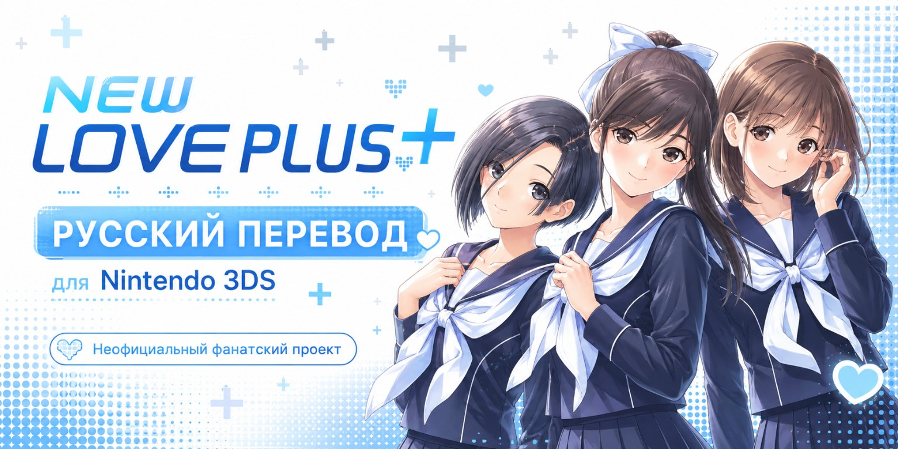

# New Love Plus+ — русский перевод для Nintendo 3DS

Неофициальная русская локализация японской версии **New Love Plus+**.

**Текущая версия: v0.1.3-beta от 28 августа 2026 года**

[Скачать готовый RAR для Luma3DS](https://github.com/slava225/New-love-plus-Russian-translation-3ds/releases/download/v0.1.3-beta/New_Love_Plus_RU_v0.1.3-beta_Luma3DS.rar)

> Это тестовая версия. Текст технически собран и проверен, но ручная сверка с японским оригиналом и полное прохождение игры ещё продолжаются. Сохраняйте резервную копию прежних файлов мода и сохранений.

## Что уже сделано

- обработаны и собраны все **183 103** подготовленных текстовых вхождения;
- пересобраны и структурно проверены **578** файлов игровых сценариев;
- обработан системный и интерфейсный текст;
- переведена значительная часть графики меню, почты, профиля, заданий, часов и дат;
- исправлены найденные проблемы компоновки, шрифтов и кнопок возврата;
- возвращён проверенный `code.bin`, необходимый для стабильного запуска патча на картридже и японской CIA;
- исправлен лимит загрузки полной русской таблицы системного текста на реальной Nintendo 3DS;
- подготовлен единый архив для установки через **Luma3DS LayeredFS**.

## Состояние перевода

| Часть проекта | Состояние |
| --- | --- |
| Подготовленные текстовые вхождения | 183 103 из 183 103 обработаны и собраны |
| Файлы игровых сценариев | 578 из 578 проходят структурную проверку |
| Системный и интерфейсный текст | Собран; продолжается проверка в игре |
| Графика интерфейса | Большая часть готова; остаточные экраны ищутся при прохождении |
| Ручная сверка с японским оригиналом | Продолжается |
| Полное тестовое прохождение на Nintendo 3DS | Продолжается |

Числа выше показывают полноту **технической обработки файлов**, а не процент литературной вычитки. Черновой перевод создавался преимущественно с применением ИИ; первичная вычитка также выполнялась с помощью Gemini 3.5 Flash. Нужна дальнейшая ручная проверка человеком, хорошо знающим японский язык.

Подробности и известные ограничения: [состояние проекта](docs/STATUS.md).

## Установка

Релиз распространяется **без xdelta**: в RAR уже лежит готовая папка `SD_ROOT` со всем необходимым.

1. Убедитесь, что у вас японская версия игры с Title ID `00040000000F4E00` и установлен Luma3DS. Регион консоли может быть европейским; поддерживаются картридж и чистая японская CIA.
2. Скачайте RAR из раздела [Releases](https://github.com/slava225/New-love-plus-Russian-translation-3ds/releases/tag/v0.1.3-beta).
3. Распакуйте архив и скопируйте **содержимое** папки `SD_ROOT` в корень SD-карты с объединением папок.
4. В настройках Luma3DS включите `Enable game patching`.
5. Запустите игру.

Полная инструкция, обновление, удаление и решение частых проблем: [INSTALLATION.md](docs/INSTALLATION.md).

## Сообщить об ошибке

Нашли неправильный перевод, непереведённый текст или проблему с интерфейсом:

[Сообщить об ошибке перевода](https://github.com/slava225/New-love-plus-Russian-translation-3ds/issues/new?template=translation-error.yml)

Патч не запускается или не применяется:

[Сообщить о проблеме установки](https://github.com/slava225/New-love-plus-Russian-translation-3ds/issues/new?template=installation-problem.yml)

Перед созданием обращения по возможности приложите фотографию или снимок экрана и укажите, где именно возникла проблема. Общие правила участия описаны в [CONTRIBUTING.md](CONTRIBUTING.md).

История изменений: [CHANGELOG.md](CHANGELOG.md).

## Как помочь

Особенно полезны:

- сверка русского текста с японским оригиналом;
- исправление естественности речи и характера персонажей;
- проверка длинных сюжетных веток на реальной Nintendo 3DS;
- снимки экранов с переполнением, обрезанным или непереведённым текстом;
- точные описания места и действий, после которых появилась ошибка.

Не прикладывайте к обращениям образы игры, сохранения с личными данными или другие защищённые материалы.

## Благодарности

Большая благодарность команде [LovePlusProject](https://github.com/LovePlusProject) и участникам связанных проектов:

- [NLPPATCH](https://github.com/LovePlusProject/NLPPATCH) — за английский проект перевода, технические исследования и документацию;
- [NLPPCTR](https://github.com/LovePlusProject/NLPPCTR) — за моды, текстуры, шаблоны и материалы для работы с графикой;
- разработчикам [NLPUnpacker](https://github.com/LovePlusProject/NLPUnpacker), [NLPTextTool](https://github.com/LovePlusProject/NLPTextTool), [nlpp-tools](https://github.com/LovePlusProject/nlpp-tools), [Trb2xlsx](https://github.com/LovePlusProject/Trb2xlsx), [png2texi](https://github.com/LovePlusProject/png2texi), [nlpp-fmt](https://github.com/LovePlusProject/nlpp-fmt) и [NLPLineWrapper](https://github.com/Aikin-Ai/NLPLineWrapper).

Полный список участников английского проекта приведён в [благодарностях NLPPATCH](https://github.com/LovePlusProject/NLPPATCH/issues/1).

## Правовая информация

Это неофициальный фанатский проект. Для использования перевода нужна собственная законная копия японской версии игры. Проект не содержит образ игры в форматах ROM, CCI, 3DS или CIA и не распространяет сохранения.

**New Love Plus+** и связанные материалы принадлежат их правообладателям.

Проект ведёт [slava225](https://github.com/slava225).
